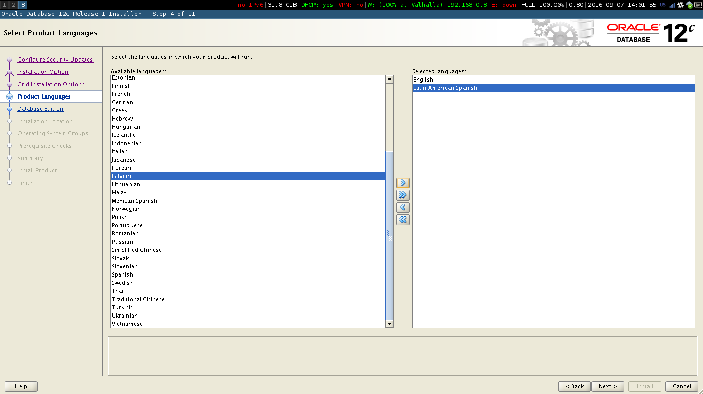
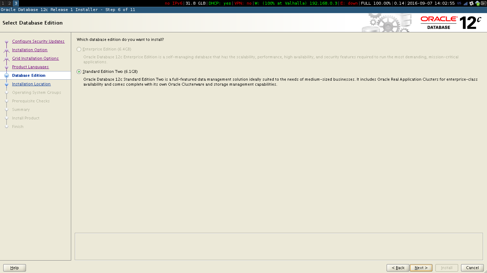
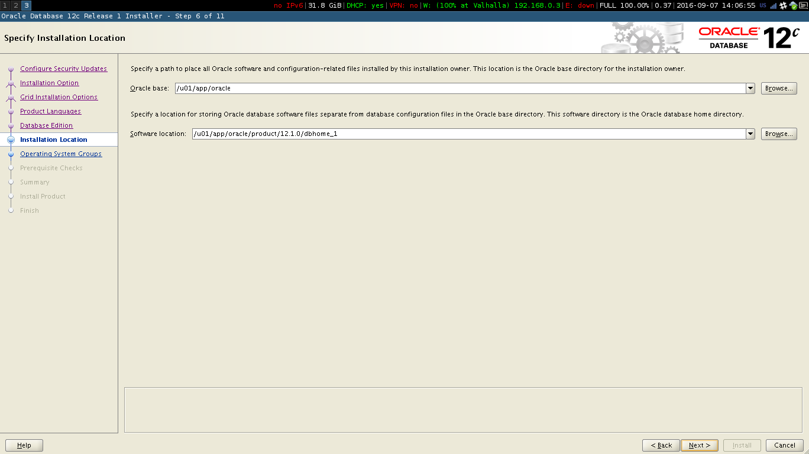
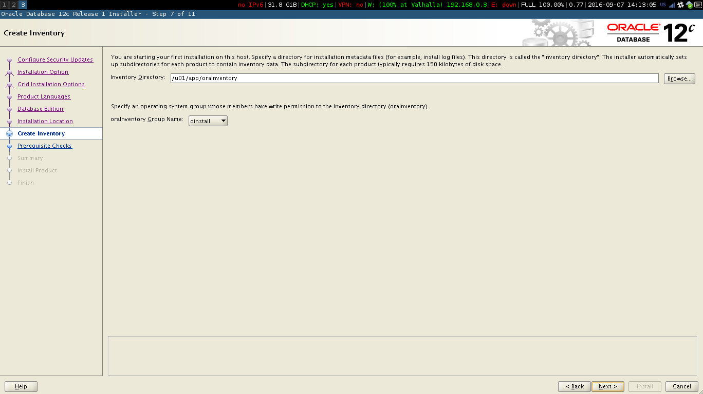
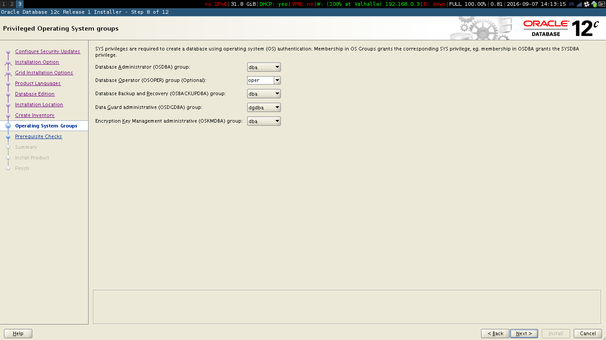
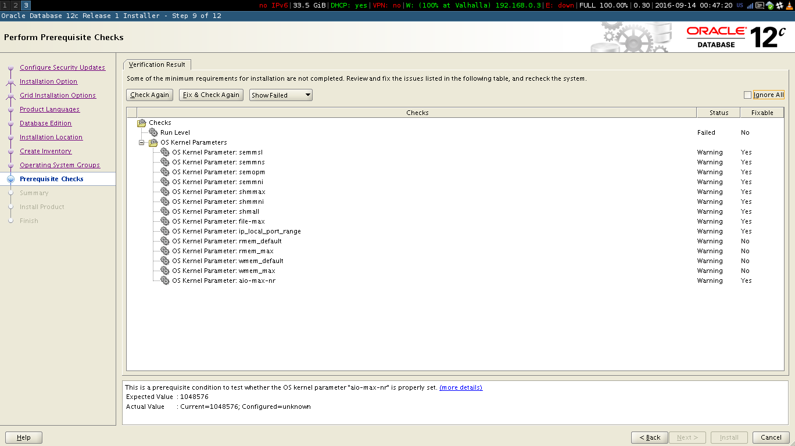
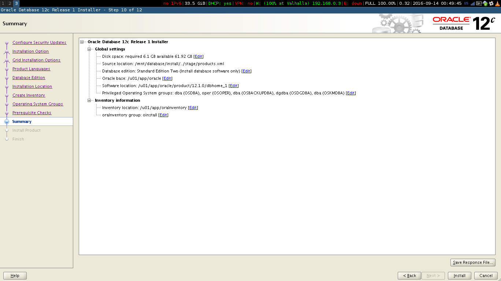

# Oracle 12c

## Instalación básica para LexSys

### Programa

1. Requisitos
2. Descarga de Software
3. Preparación del Sistema Operativo
4. Instalación Oracle Database
5. Creación de Esquema y Tablespace

### Requisitos

#### Hardware

* 2 GB RAM
* SWAP >= RAM
* 6.5 GB Disco Duro
* 50 GB x 3 meses datos

#### Software

* Oracle Linux 5, 6 y 7
* Red Hat Enterprise Linux 5, 6 y 7
* CentOS 5, 6 y 7

#### Descarga de Software

http://www.oracle.com/technetwork/database/enterprise-edition/downloads/

Requiere registro en el sitio de Oracle Technology Network

### Preparación del Sistema Operativo

1. Dependencias
2. Descarga de Software
3. Ajuste de Parámetros
4. Directorios y usario oracle

#### Dependencias

    yum groupinstall -y "X Window System"
    curl -o ora_bootstrap.sh \
      https://gist.githubusercontent.com/ecelis/0b8fa0fddd4d28c59bffbe6620fa461d/raw/8217cfe6bdd5aa3996853dc40e587ba33ff7dcdf/ora_bootstrap.sh
    chmod +x ora_bootstrap.sh
    ./ora_bootstrap.sh

#### Ajuste de parámetros

**/etc/grub2.cfg**

    kernel /vmlinuz-2.6.32-300.25.1.el6uek.x86_64 ro root=LABEL=/ transparent_hugepage=never

##### Parámetros del Kernel

**/etc/sysctl.d/10-oracle.conf**

    fs.aio-max-nr = 1048576
    fs.file-max = 6815744
    kernel.shmall = 2097152
    kernel.shmmax = 536870912
    kernel.shmmni = 4096
    kernel.sem = 250 32000 100 128
    net.ipv4.ip_local_port_range = 9000 65500
    net.core.rmem_default = 262144
    net.core.rmem_max = 4194304
    net.core.wmem_default = 262144
    net.core.wmem_max = 1048576

##### Límite de Recursos del Sistema Operativo

**/etc/security/limits.conf**

    oracle   soft   nofile  1024
    oracle   hard   nofile  65536
    oracle   soft   nproc   2047
    oracle   hard   nproc   16384
    oracle   soft   stack   10240
    oracle   hard   stack   32768

**/etc/pam.d/login**

    session   required  pam_limits.so

#### Directorios y usario oracle

    groupadd -g 54321 oinstall
    groupadd -g 54322 dba
    groupadd -g 54323 oper
    groupadd -g 54325 dgdba
    groupadd -g 54327 asmdba
    groupadd -g 54328 asmoper
    groupadd -g 54329 asmadmin
    useradd -u 54321 -g oinstall \
        -G dba,oper,asmdba,dgdba,asmoper,asmadmin oracle
    passwd oracle
    mkdir -p /u01/app/oracle
    chown -R oracle:oinstall /u01/app
    chmod -R 775 /u01/app

#### Scheduler

    echo deadline > /sys/block/${ASM_DISK}/queue/scheduler

**${ASM\_DISK}** es el dispositivo de bloques que alberga el directorio
**$ORACLE\_BASE**

#### Variables de Entorno

    ORACLE_BASE=/u01/app/oracle
    ORACLE_HOME=/u01/app/oracle/product/12.1.0/dbhome_1
    ORACLE_SID=SIGIPPEM_USR

### Instalación Oracle Database

Desde una computadora remota:

    xhost +
    ssh -X oracle@db.host.url

En el servidor de Oracle vía SSH

    unzip linuxamd64_12102_database_se2_1of2.zip
    unzip linuxamd64_12102_database_se2_2of2.zip
    cd database
    ./runInstaller

#### Configuración de actualizaciones de seguridad

#### Opciones de Instalación

Instala solo la base de datos

Selecciona el tipo de instalación, **Single Instance**

Selecciona el idioma

Selecciona la edición según la licencia de Oracle que tengas

Revisa las rutas de instalación, **$ORACLE\_BASE** y **$ORACLE\_HOME**

Ruta del inventario de productos instalados

Grupos del sistema operativo, membresia en estos grupos otorga
privilegios al usuario SYS de oracle, **OSDBA** otorga privilegios de
**SYSDBA**

Verifica que los requisitos pasen la prueba y arregla los que fallen

Sumario de la instalación, clic en **Install**

Al finalizar la instalación es necesario ejecutar los siguientes
comandos como usuario root

    /u01/app/oraInventori/oraInstall.sh
    /u01/app/oracle/app/product/12.1/db_home1/root.sh

### Esquema y Tablespace

    CREATE TABLESPACE <LEXUSR>_DAT DATAFILE '<LEXUSR>_DAT.DBF' SIZE 2000M
      AUTOEXTEND ON NEXT 1000M MAXSIZE UNLIMITED LOGGING
      EXTENT MANAGEMENT LOCAL AUTOALLOCATE BLOCKSIZE 8K
      SEGMENT SPACE MANAGEMENT AUTO FLASHBACK ON;

Crea el tablespace para los datos, sustituye **LEXUSR** de acuerdo a tu ambiente.

Crea el tablespace para los índices, sustituye **LEXUSR** de acuerdo a tu ambiente.

    CREATE TABLESPACE <LEXUSR>_INX DATAFILE '<LEXUSR>_INX.DBF' SIZE 1000M
      AUTOEXTEND ON NEXT 500M MAXSIZE UNLIMITED LOGGING
      EXTENT MANAGEMENT LOCAL AUTOALLOCATE BLOCKSIZE 8K
      SEGMENT SPACE MANAGEMENT AUTO FLASHBACK ON;

Crea el usuario (schema) de Oracle y otorga los permisos necesarios

      CREATE USER <DBUSER> IDENTIFIED BY <DBPASS> DEFAULT TABLESPACE LEXSYS_DAT
        QUOTA UNLIMITED ON <LEXUSR>_DAT;
      GRANT CONNECT TO <DBUSER>;
      GRANT RESOURCE TO <DBUSER>;
      ALTER USER <DBUSER> QUOTA UNLIMITED ON <LEXUSR>_INX;

No olvides _hacer commit_ para que los cambios en Oracle apliquen

      COMMIT;

### Referencias

* https://docs.oracle.com/en/database/

